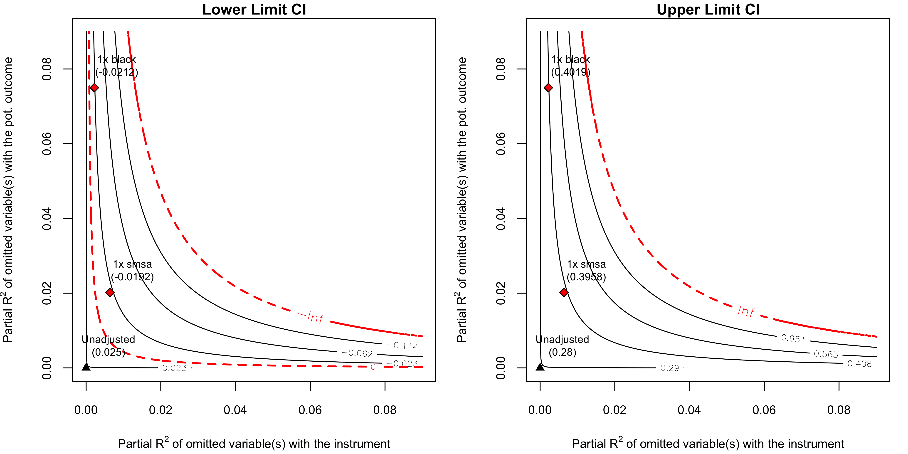

<!-- README.md is generated from README.Rmd. Please edit that file -->

# iv.sensemakr: Sensitivity Analysis Tools for IV 

<!-- badges: start -->

[](https://CRAN.R-project.org/package=iv.sensemakr)
[](https://github.com/carloscinelli/iv.sensemakr/actions/workflows/R-CMD-check.yaml)
[](https://app.codecov.io/gh/carloscinelli/iv.sensemakr)
<!-- badges: end -->

`iv.sensemakr` implements a suite of sensitivity analysis tools for
instrumental variable estimates, as discussed in Cinelli, C. and
Hazlett, C. (2025) “An Omitted Variable Bias Framework for Sensitivity
Analysis of Instrumental Variables”, *Biometrika*
([doi:10.1093/biomet/asaf004](https://doi.org/10.1093/biomet/asaf004);
[PDF](https://carloscinelli.com/files/Cinelli%20and%20Hazlett%20-%20OVB%20for%20IV.pdf)).

# News

- `iv.sensemakr` is now on
  [CRAN!](https://CRAN.R-project.org/package=iv.sensemakr)

- Package website [is now
  online.](https://carloscinelli.com/iv.sensemakr/)

- Paper published in
  [Biometrika.](https://doi.org/10.1093/biomet/asaf004) You can find a
  [free version
  here.](https://carloscinelli.com/files/Cinelli%20and%20Hazlett%20-%20OVB%20for%20IV.pdf).

- Watch the [video of the talk at
  PCIC.](https://www.youtube.com/watch?v=ykZqPB1FPNo)

- Watch the [video of the talk at
  JSM.](https://www.youtube.com/watch?v=0b5VYWh8fN4)

# Installation

To install `iv.sensemakr` from CRAN:

``` r
install.packages("iv.sensemakr")
```

To install the development version from GitHub, make sure you have the
package `devtools` installed:

``` r
# install.packages("devtools")
devtools::install_github("carloscinelli/iv.sensemakr")
```

# Basic usage

``` r
# loads package
library(iv.sensemakr)

# loads dataset
data("card")

# prepares data
y <- card$lwage  # outcome
d <- card$educ   # treatment
z <- card$nearc4 # instrument
x <- model.matrix( ~ exper + expersq + black + south + smsa + reg661 + reg662 +
                     reg663 + reg664 + reg665+ reg666 + reg667 + reg668 + smsa66,
                   data = card) # covariates
# fits IV model
card.fit <- iv_fit(y,d,z,x)

# see results
card.fit
#> 
#> Instrumental Variable Estimation
#> (Anderson-Rubin Approach)
#> =============================================
#> IV Estimates:
#>   Coef. Estimate: 0.132
#>   t-value: 2.33
#>   p-value: 0.02
#>   Conf. Interval: [0.025, 0.285]
#> Note: H0 = 0, alpha = 0.05, df = 2994.
#> =============================================
#> See summary for first stage and reduced form.

# runs sensitivity analysis
card.sens <- sensemakr(card.fit, benchmark_covariates = c("black", "smsa"))

# see results
card.sens
#> 
#> Sensitivity Analysis for Instrumental Variables
#> (Anderson-Rubin Approach)
#> =============================================================
#> IV Estimates:
#>   Coef. Estimate: 0.132
#>   t-value: 2.33
#>   p-value: 0.02
#>   Conf. Interval: [0.025, 0.285]
#> 
#> Sensitivity Statistics:
#>   Extreme Robustness Value: 0.000523
#>   Robustness Value: 0.00667
#> 
#> Bounds on Omitted Variable Bias:
#>  Bound Label  R2zw.x R2y0w.zx Lower CI Upper CI Crit. Thr.
#>     1x black 0.00221   0.0750  -0.0212    0.402       2.59
#>      1x smsa 0.00639   0.0202  -0.0192    0.396       2.57
#> 
#> Note: H0 = 0, q >= 1, alpha = 0.05, df = 2994.
#> =============================================================
#> See summary for first stage and reduced form.

# sensitivity contour plot
plot(card.sens, lim = 0.09)
```



``` r

# latex code for sensitivity table
ovb_minimal_reporting(card.sens, outcome_label = "lwage", treatment_label = "educ")
#> \begin{table}[!h]
#> \centering
#> \begin{tabular}{lrrrrrr}
#> \multicolumn{7}{c}{Outcome: \textit{lwage}} \\
#> \hline \hline 
#> Treatment: & Est. & Lower CI & Upper CI & t-value & $XRV_{q = 1, \alpha = 0.05}$ & $RV_{q = 1, \alpha = 0.05}$  \\ 
#> \hline 
#> \textit{educ} & 0.132 & 0.025 & 0.285 & 2.327 & 0.1\% & 0.7\% \\ 
#> \hline 
#> df = 2994 & & \multicolumn{5}{r}{ \small \textit{Bound (1x black)}: $R^2_{Z\sim W| {\bf X}}$ = 0.2\%, $R^2_{Y(0)\sim W| Z, {\bf X}}$ = 7.5\%} \\
#> \end{tabular}
#> \end{table}
```

``` r
# html code for sensitivity table
ovb_minimal_reporting(card.sens, format = "pure_html",
                      outcome_label = "lwage", treatment_label = "educ")
```

<table style="align:center">

<thead>

<tr>

<th style="text-align:left;border-bottom: 1px solid transparent;border-top: 1px solid black">

</th>

<th colspan="6" style="text-align:center;border-bottom: 1px solid black;border-top: 1px solid black">

Outcome: lwage
</th>

</tr>

<tr>

<th style="text-align:left;border-top: 1px solid black">

Treatment
</th>

<th style="text-align:right;border-top: 1px solid black">

Est.
</th>

<th style="text-align:right;border-top: 1px solid black">

Lower CI
</th>

<th style="text-align:right;border-top: 1px solid black">

Upper CI
</th>

<th style="text-align:right;border-top: 1px solid black">

t-value
</th>

<th style="text-align:right;border-top: 1px solid black">

XRV<sub>q = 1, α = 0.05</sub>
</th>

<th style="text-align:right;border-top: 1px solid black">

RV<sub>q = 1, α = 0.05</sub>
</th>

</tr>

</thead>

<tbody>

<tr>

<td style="text-align:left; border-bottom: 1px solid black">

<i>educ</i>
</td>

<td style="text-align:right;border-bottom: 1px solid black">

0.132
</td>

<td style="text-align:right;border-bottom: 1px solid black">

0.025
</td>

<td style="text-align:right;border-bottom: 1px solid black">

0.285
</td>

<td style="text-align:right;border-bottom: 1px solid black">

2.327
</td>

<td style="text-align:right;border-bottom: 1px solid black">

0.1%
</td>

<td style="text-align:right;border-bottom: 1px solid black">

0.7%
</td>

</tr>

</tbody>

<tr>

<td colspan="7" style="text-align:right;border-bottom: 1px solid transparent;font-size:11px">

Note: df = 2994; Bound ( 1x black ): R<sup>2</sup><sub>Z~W\|X</sub> =
0.2%, R<sup>2</sup><sub>Y(0)~W\|Z,X</sub> = 7.5%
</td>

</tr>

</table>
